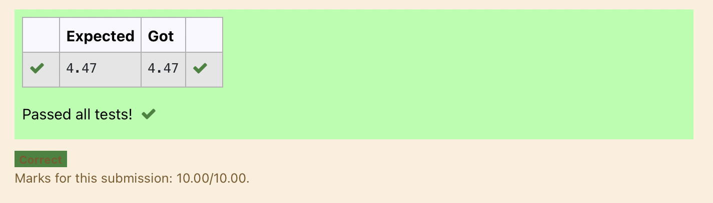

# DISTANCE-BETWEEN-TWO-POINTS

## AIM:
To write a python program to find the distance two 2 points
## ALGORITHM:
### Step 1: 
Start the Program.
### Step 2: 
Get the values from user.
### Step 3: 
Substitute the values in the distance formula  

### Step 4: 
Display the output value.
### Step 5: 
End the program.
### PROGRAM:
  
#Program to find the distance between two points.

#Developed by: K.SaiEswar

#RegisterNumber: 21000679

import math

l1=[10,6]

l2=[4,2]

value = math.sqrt(((l1[0]-l2[0])**2)-((l1[1]-l2[1])**2))

print("{:.2f}".format(value))

### OUTPUT:

### RESULT:
Thus the distance between two points are successfully executed
